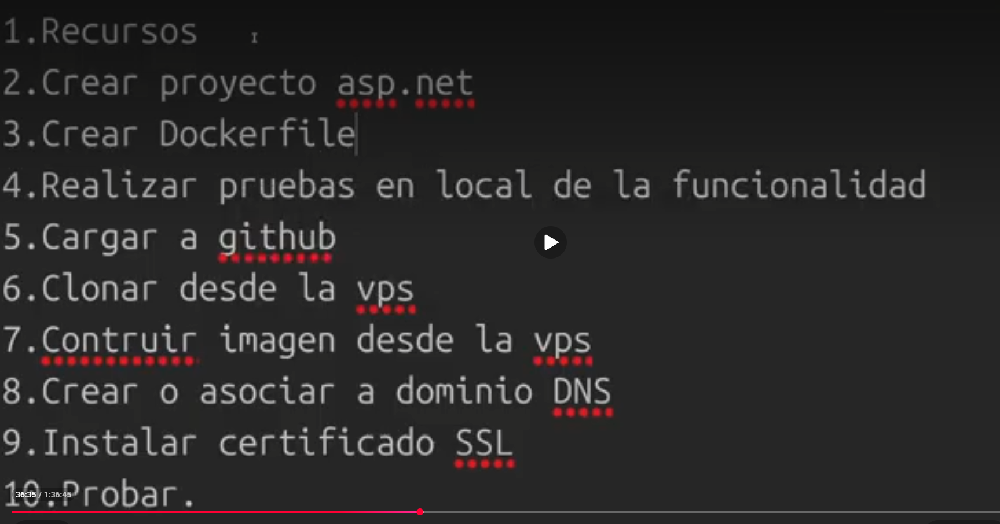

### Paso #1

Se ejecuta el comando en donde se encuentra el docker file

docker build -t <image name> .
. hace mencion a la ruta
. desde aqui creame una imagen
una vez creada la imagen revisar si ya esta creada (docker images)
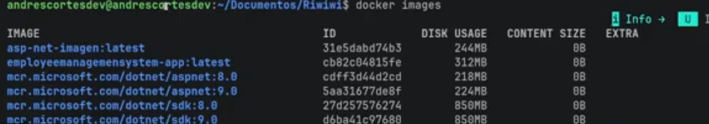
imgname: versionar(si no se envia version el asume es la ultima)

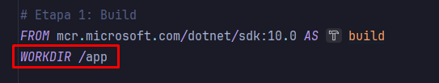

pasa la copia del codigo a la carpeta de docker WORKDIR /app

docker run -d -p 8080:8080 --name <container name> <image name>

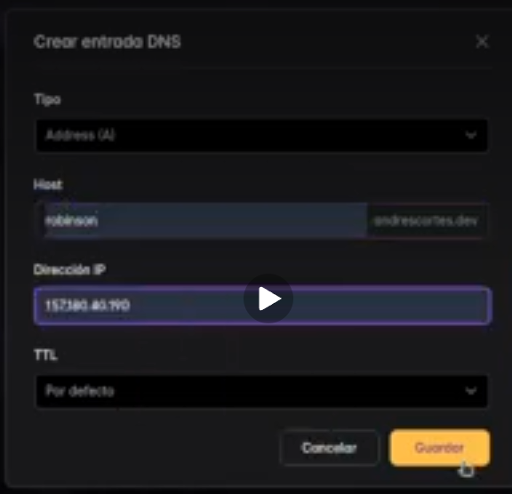
dns

agg esto en dns available
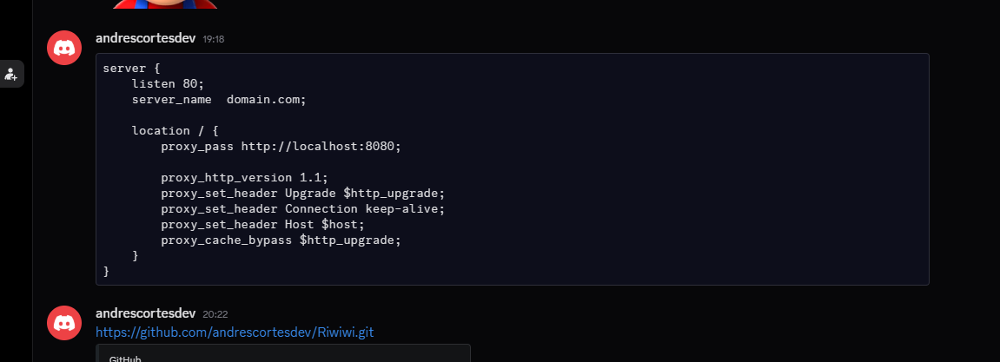

Juan.Andromeda.dev
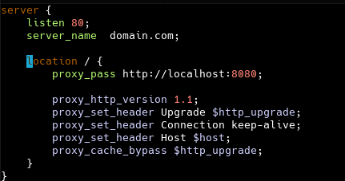

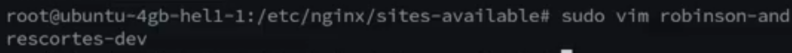

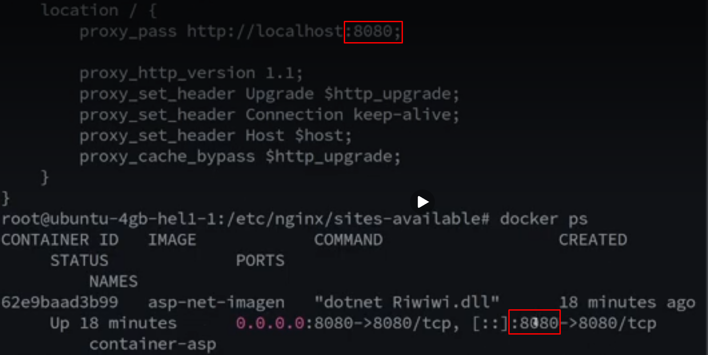
veri data

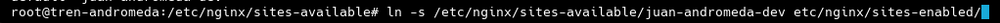
carpeta espejo

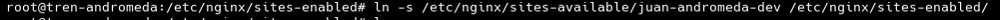

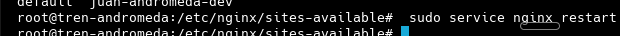
restart

terminal every step
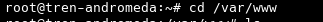

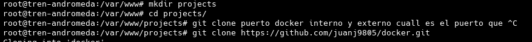

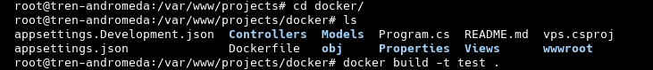

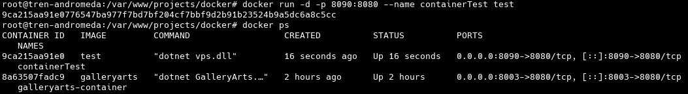

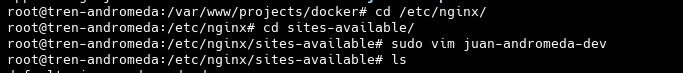

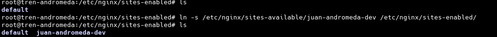

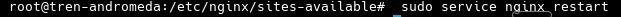
